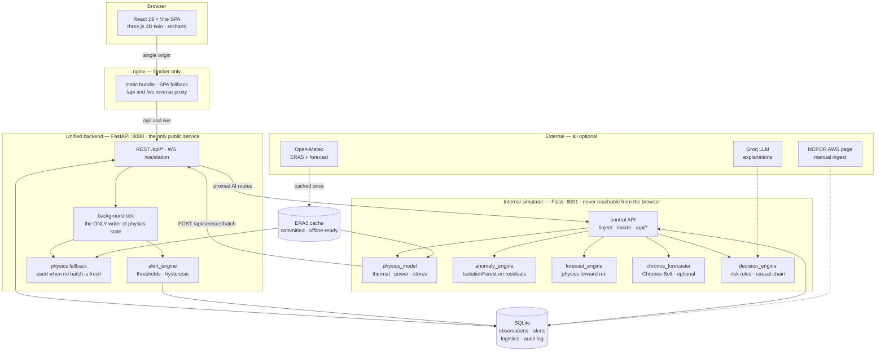

# AURORA — Antarctic Research Station Digital Twin

[](https://github.com/Saeesh-Vele/SIH2026A/actions/workflows/ci.yml)
[](https://github.com/Saeesh-Vele/SIH2026A/actions/workflows/docker.yml)

A physics-informed, AI-assisted digital twin of India's Antarctic research stations
**Maitri** and **Bharati** — built for Smart India Hackathon problem statement **26060**
(efficient management of remote research stations).

Aurora drives a physics model of each station's power, heating, water and comms systems
with **real ERA5 reanalysis weather**, detects anomalies in the *residuals* between
predicted and observed behaviour, projects failure timelines, and explains its reasoning
in operator language — tracking the provenance of every number it shows.

> **It is a prototype, not an operational system.** There are no live sensor feeds from
> Antarctica. Equipment telemetry is model-derived, and the UI says so on every value.
> See [Provenance](#provenance) and [Known limitations](#known-limitations).

---

## The interface

| | |
|---|---|
|  |  |
| **Overview.** The 3D twin, with weather, generation and subsystem cards. Building colours follow the alert state. | **Infrastructure.** Building telemetry and the dependency map. Light and dark themes throughout. |
|  |  |
| **What-if.** A rule-based hazard applied to the current snapshot, with its assumptions. | **Guided tour.** 12 steps on a first visit; restart it from Help (?) or the command palette. |

- **One top bar.** Station switcher, data source (live simulator / physics fallback / browser
  demo), telemetry link, alerts, event log, search (⌘K), help, Demo control and **Sign in**,
  visible at every width.
- **Sidebar sections.** Monitor (Overview, Weather, Infrastructure, Energy grid), Operate
  (Logistics, Remote commands), Analyse (What-if, AI diagnostics, Reports, Twin inspector)
  and System (Administration). On phones the sidebar becomes a drawer.
- **Provenance on every value.** A chip shows Real, Reanalysis, Model-derived, Simulated or
  Hardcoded-demo, and each page shows how fresh its data is.
- **Changes need sign-in and confirmation.** Every change asks first and reports its result.
  Without the operator token everything is read-only.
- **Keyboard.** ⌘K / Ctrl+K opens the command palette, `?` the help, and `g` then a letter
  jumps to a page. A "Skip to content" link comes first, and every control shows a focus ring.
- **Shareable URLs.** `?module=&station=` opens a page directly. `?tour=off` suppresses the
  first-visit tour (for screenshots and demos); `?tour=start` forces it.
- **No WebGL.** A 2D station overview replaces the 3D twin.

Design notes, decisions and every review checkpoint's screenshots are in
[docs/ui-redesign.md](docs/ui-redesign.md).

---

## Quick start

### Docker (any Linux server, x86 or ARM)

```bash
git clone https://github.com/Saeesh-Vele/SIH2026A.git aurora && cd aurora
cp .env.example .env        # set ALLOWED_ORIGINS if not browsing via localhost
docker compose up -d
```

Open <http://localhost>. Three containers come up: nginx (UI + reverse proxy), the
backend, and the internal simulator. Only nginx publishes a port. Needs ~2 GB RAM, no
internet at run time.

On a small VM, pull the published multi-arch images instead of building:

```bash
docker compose -f docker-compose.yml -f docker-compose.prod.yml up -d
```

Full instructions, HTTPS, backups and provider notes: **[docs/DEPLOYMENT.md](docs/DEPLOYMENT.md)**.

### Local development

```bash
make setup                  # .venv + npm install + Playwright chromium
cp .env.example .env
make dev                    # == ./start.sh  (Windows: start.ps1)
```

`start.sh` starts the backend, waits for `/api/health`, then the simulator, then Vite,
and stops all three on Ctrl-C. UI on <http://localhost:5173>. `make help` lists every
target.

---

## Architecture



**Binding rules** (see [CLAUDE.md](CLAUDE.md)):

- `simulator/unified_backend.py` is the **single backend**. The browser talks only to it.
- `simulator/simulator.py` is **internal**. The browser must never call it; what the UI
  needs is proxied through the backend (`/api/ai/*`, `/api/sim/*`, `/api/aurora-explain`).
- The backend's background tick is the **only** code that advances physics state. Every
  GET and WS read returns the last published snapshot.
- Station facts live in **one** file, `simulator/station_config.json` — coordinates,
  buildings, dependency graph, thresholds, remote-command catalogue.
- `legacy/` holds a retired Java Spring Boot backend and AI service. Not started, not
  extended.

---

## Features by pillar

| | Capability | Status |
|---|---|---|
| **Physics twin** | Thermal envelope, generator (Willans line + coolant), power balance, water, stores, per-building indoor temperature, driven by ERA5 replay | 🟢 Working. 35 invariant tests. Building parameters are **estimated**, not from NCPOR drawings |
| | Dependency cascade across subsystems | 🟢 Working, from the config's dependency graph |
| **Monitoring** | Live telemetry over WebSocket, per-sensor history, 3D twin with a 2D fallback | 🟢 Working |
| | Threshold alerts for every sensor, persisted, acknowledged with who/when, hysteresis auto-resolve | 🟢 Working |
| | Operator-editable thresholds (System Admin) | 🟢 Working, stored in SQLite |
| **Anomaly detection** | IsolationForest on physics **residuals** (not raw values), per station, with the expected value from the same tick | 🟡 Working; validated only against synthetic degradations |
| **Forecasting** | Physics forward run on the live Open-Meteo forecast (30 m – 24 h) | 🟢 Working. Self-consistency MAE ≈ 0.5–0.9 °C on generator temperature |
| | Chronos-Bolt zero-shot statistical forecast | 🟡 Optional (`WITH_ML=true`). Honestly reports `available: false` when absent |
| | Forecast arena (baseline vs physics vs Chronos) | 🟠 Offline benchmark script; the physics leg is a noise approximation, not a true forward run |
| **Decision support** | Rule-based risk scoring, causal chain, recommended action with confidence | 🟠 Experimental. Weights are prototypes, thresholds are **not** certified |
| | Explanations in operator language | 🟢 Offline explainer always available; Groq LLM when `GROQ_API_KEY` is set |
| | What-if scenarios (7), read-only against the published snapshot | 🟢 Working |
| | Remote command dispatch | 🟡 **Simulated** lifecycle only — nothing is actuated |
| **Logistics** | Operator-entered inventory ledger with an audit log | 🟢 Working |
| **Operations** | Single-command Docker deploy, multi-arch images, HTTPS overlay, works offline | 🟢 Working |
| | Write protection for a public deployment | 🟡 Demo-grade: one shared `ADMIN_TOKEN` on every write, nginx rate limits, an LLM spend cap |
| | User accounts / RBAC | 🔴 **Not implemented.** The user list in System Admin is labelled HARDCODED-DEMO |

---

## Provenance

Aurora never presents fabricated data as real. Every value the UI shows carries exactly
one of these labels, and the badge in the top bar reports where the current telemetry
stream comes from:

| Label | Meaning | Where it appears |
|---|---|---|
| **REAL** | Measured by an instrument | NCPOR AWS rows ingested from the public page |
| **REANALYSIS** | ERA5 (ECMWF via Open-Meteo) — observations assimilated by a model, *not* a sensor on the Maitri roof | All replay weather |
| **MODEL-DERIVED** | Computed by Aurora's physics model | All equipment telemetry: generator temperature, load, fuel rate, indoor temperatures, stores |
| **SIMULATED** | Deliberately injected | Demo Control scenarios, simulation mode, remote-command results |
| **HARDCODED-DEMO** | Fixed example content | The System Admin user list |

Labels that are **not** used, because they would not be true: "LSTM", "neural network",
"official NCPOR telemetry", "certified thresholds".

The data source for every live reading is one of `simulator` (the physics simulator is
feeding batches), `physics-fallback` (the backend's own tick), or `browser-demo` (a
clearly marked client-side random walk shown only when the backend is unreachable).

---

## Configuration

The root `.env` is the single source of configuration — copy `.env.example`, which
documents every variable. Python reads it through `simulator/config.py` (the only module
in `simulator/` that touches `os.environ`); the frontend reads only `VITE_*`, through
`src/config.js`.

| Variable | Default | Purpose |
|---|---|---|
| `APP_ENV` | `development` | `production` makes the backend refuse to start on a development-grade config (no `ADMIN_TOKEN`, localhost origins) |
| `ADMIN_TOKEN` | empty | When set, every state-changing endpoint needs `X-Admin-Token`. Reads stay public — see [Write protection](#write-protection). Generate with `openssl rand -hex 32` |
| `GROQ_MAX_CALLS_PER_HOUR` | `60` | Hard cap on outbound LLM calls per rolling hour; past it the explain routes serve the offline summary |
| `ALLOWED_ORIGINS` | `http://localhost:5173` | Origins allowed by CORS **and** the `/ws/station` check. **Must** match how the browser reaches the UI. `*` is rejected |
| `HOST` / `API_PORT` / `SIM_PORT` | `127.0.0.1` / `8080` / `8001` | Bind address and ports (containers override `HOST` to `0.0.0.0`) |
| `BACKEND_URL` / `SIMULATOR_URL` | localhost | Service-to-service addresses |
| `DB_PATH` | `data_store/antarctic_observations.db` | SQLite file; relative paths resolve against `simulator/` |
| `AURORA_MODE` | `reanalysis` | `reanalysis` (ERA5 replay) or `simulation` (random walk) |
| `AURORA_SPEED` | `120` | Simulated seconds per real second — `speed/60` simulated hours per real minute |
| `AURORA_DATE` | newest cached | ERA5 replay start date (`YYYY-MM-DD`) |
| `TICK_INTERVAL_S` | `2.0` | Backend tick cadence |
| `SIM_BATCH_FRESH_S` | `10` | How long a simulator batch counts as fresh before the physics fallback takes over |
| `ALERT_RESOLVE_TICKS` | `3` | Normal ticks before an alert auto-resolves (hysteresis) |
| `HISTORY_MAX_POINTS` | `300` | Per-sensor history kept in memory |
| `REMOTE_ACK_DELAY_S` | `5` | Simulated remote-command acknowledgement delay |
| `LOG_LEVEL` | `INFO` | Shared by every service |
| `GROQ_API_KEY` / `GROQ_MODEL` | empty | Optional LLM explanations; without a key the offline explainer is used and says so |
| `HTTP_PORT` | `80` | Docker: host port for the UI |
| `WITH_ML` | `false` | Docker: build the simulator with torch + Chronos (needs 4 GB+) |
| `SIMULATOR_MEMORY_LIMIT` | `768M` | Docker: simulator container memory ceiling |
| `DOMAIN` / `ACME_EMAIL` | empty | Docker: required by the HTTPS overlay |
| `VITE_API_URL` / `VITE_WS_URL` | localhost:8080 | Frontend targets; Docker builds use `/api` and `/ws/station` for a single origin |
| `VITE_ENABLE_FIREBASE` | `false` | Firebase is **off** (it had public read/write rules). The SDK is a dynamic import, so a default build does not even ship it |

---

## Write protection

A deployment is meant to be *viewable* by anyone and *changeable* by nobody without a
token. Set `ADMIN_TOKEN` and every state-changing endpoint requires
`X-Admin-Token` — thresholds, logistics edits, alert acknowledge, remote dispatch,
simulator inject/reset/mode, NCPOR ingest and telemetry ingest. Reads and the WebSocket
stay public, and the two POSTs that change nothing (what-if, explain) stay public too and
are rate-limited instead.

In the UI a **READ-ONLY** pill in the top bar opens an operator login; the token is held in
memory only, so refreshing signs you out. Without a login the dashboard is fully usable and
write controls are disabled with the reason in their tooltip. With no `ADMIN_TOKEN`
configured the pill is not shown at all, so local development is unchanged.

nginx adds per-address rate limits (30 r/s on `/api`, 5 r/min on the explain routes,
64 concurrent connections) and a 64 kB body cap, returning `429`/`413` with a readable
message. `GROQ_MAX_CALLS_PER_HOUR` bounds LLM spend regardless.

This is demo-grade: one shared token, **no user accounts and no roles** — see
[Known limitations](#known-limitations) and [docs/DEPLOYMENT.md](docs/DEPLOYMENT.md).

## Testing

| Suite | Command | Count |
|---|---|---|
| Python | `pytest` (repo root) | 357, offline, no network |
| Python — ML | `pytest -m ml` | 7, needs `make setup-ml` (torch + chronos) |
| Python — slow | `pytest -m slow` | 16, ERA5 walk-forward over the committed caches |
| Frontend | `npm test` (Vitest + jsdom) | 124 |
| End-to-end | `npm run test:e2e` (Playwright) | 13, starts the whole stack itself |

```bash
make test        # pytest + Vitest
make lint        # ruff check . (exits 0) + oxlint
make coverage    # simulator/ coverage — currently 70%
make e2e
```

CI runs on every push and pull request: ruff + pytest + coverage, lint + Vitest + build
on Node 20 and 22, the Playwright smoke test, and a gitleaks secret scan. A second
workflow builds and publishes multi-arch (amd64 + arm64) images, after bringing the whole
compose stack up and verifying it — including with the network blocked.

To run the end-to-end suite against a deployment, set `E2E_BASE_URL` (and `ADMIN_TOKEN` to
cover sign-in). Against anything other than localhost, the three tests that change server
state are skipped: fault injection, a simulator reset and a ledger edit. Set
`E2E_ALLOW_LIVE_WRITES=1` to run them anyway; each one puts back what it changed (reset in
`finally`, and the ledger value restored and checked).

`ruff format` is deliberately **not** enforced; it would reflow 43 of 57 files. Use
`make format-check` to see what it would do.

---

## Repository layout

```
simulator/              Python services and engines
  unified_backend.py      FastAPI — the single public backend (:8080)
  simulator.py            Flask — internal physics + AI loop (:8001)
  physics_model.py        Thermal / power / stores model
  anomaly_engine.py       IsolationForest on physics residuals
  forecast_engine.py      Physics forward run on the live forecast
  chronos_forecaster.py   Chronos-Bolt (optional)
  decision_engine.py      Risk rules, causal chain, recommendations
  alert_engine.py         Threshold alerts, hysteresis, persistence
  station_config.json     THE single source of station facts
  config.py               The only module reading os.environ
  migrations/             Idempotent SQLite migrations
  tests/                  pytest suite
src/                    React app: shell/ (top bar, sidebar, palette, shortcuts, URL state),
                          modules/ (one folder per page), overlays/ (drawers), tour/
                          (guided tour), ui/ (shared components), theme/ (design tokens)
docker/                 Dockerfiles, nginx config, Caddyfile, entrypoint
tests/e2e/              Playwright smoke test
docs/DEPLOYMENT.md      Server deployment guide
legacy/                 Retired Java backend + AI service. Do not extend
PROJECT_CONTEXT.md      Codebase audit; issue IDs referenced by commits
CLAUDE.md               Working rules and architecture decisions
```

---

## Known limitations

- **No live hardware feed.** Equipment telemetry is model-derived from ERA5 weather.
  Aurora has never seen a real generator in Antarctica.
- **Ground truth is the model itself.** Forecast validation measures the physics model's
  self-consistency under perfect weather, not real-world forecast skill.
- **Building parameters are estimated** (U-values, areas, generator curves), not taken
  from NCPOR drawings. Every parameter carries a `basis` field saying so.
- **Anomaly detection is validated only against synthetic degradations.** Subtle,
  real-world wear has not been demonstrated.
- **Chronos is zero-shot** at its native prediction length, benchmarked on one weather
  period, and optional.
- **The forecast arena's physics leg is a noise-based approximation**, not a true forward
  run — the number is not a fair comparison.
- **Remote commands are simulated.** Nothing is actuated.
- **No user accounts or RBAC.** `ADMIN_TOKEN` gates all writes behind one shared secret;
  there are no identities, no roles, and the operator name on an audit record is
  self-declared. Anyone holding the token can change anything.
- **Thresholds are prototypes**, not certified safety limits.
- **Firebase is disabled** and should stay disabled until scoped rules and auth exist.

---

## Licence and credits

Weather data: [Open-Meteo](https://open-meteo.com/) (ERA5 reanalysis, ECMWF).
Station metadata: public NCPOR / Ministry of Earth Sciences sources — each field in
`station_config.json` records its source and a confidence note.
Forecasting: [Amazon Chronos-Bolt](https://github.com/amazon-science/chronos-forecasting).

Built for Smart India Hackathon, problem statement 26060.
